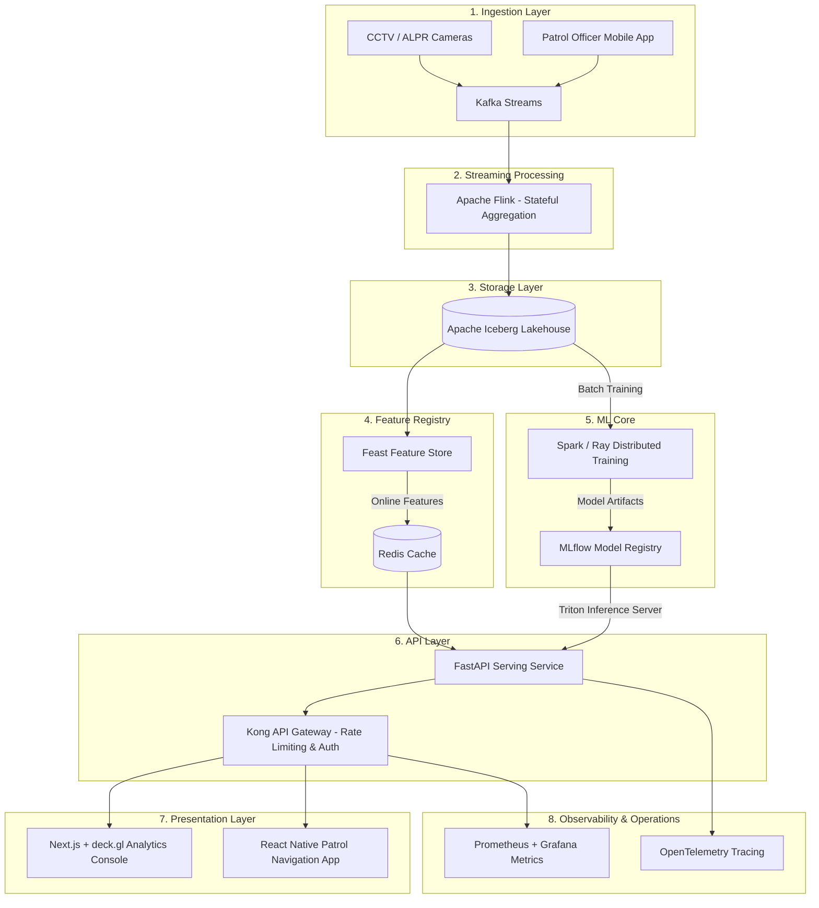

# look_Around — Bengaluru Parking Intelligence 🚦

AI-driven spatial parking violation patterns, congestion scoring, and patrol enforcement priority queues for Bengaluru City.

[](src/api/main.py)
[](dashboard/)
[](src/geo.py)
[](src/ingest.py)

---

## 1. Project Overview

`look_Around` transforms a static, anonymized dataset of **298,450 parking violations** (spanning November 2023 – April 2024 in Bengaluru) into three operational outputs designed to shift enforcement teams from **reactive towing** to **proactive patrol dispatch**:

1. **Violation Heatmap (H3):** WebGL-rendered spatial density hexes at city-level (Res 7) and street-level (Res 9).
2. **Congestion-Impact Score:** An AI-generated congestion proxy (0.0 to 1.0) for 55 police station sectors and custom junctions, with detailed metric breakdowns.
3. **Enforcement Priority Queue:** A live ranked feed of high-congestion, high-recurrence cells grouped into dispatch priority tiers (`IMMEDIATE`, `HIGH`, `MODERATE`, `LOW`).

---

## 2. Tech Stack & Architecture

We built a **lean, zero-ops, in-memory architecture** optimized for hackathon performance:

* **Data Analytics:** [DuckDB](src/ingest.py) (embedded SQL engine for ultra-fast aggregation over 300K rows in <15ms).
* **Spatial Indexing:** [Uber H3](src/geo.py) (spatial indexing at Res 7 and Res 9 for O(1) containment lookups).
* **Hotspot Detection:** [DBSCAN](src/models/hotspot.py) (density-based spatial clustering of chronic cells without pre-specifying cluster counts).
* **Predictive Congestion Core:** [LightGBM Regressor](src/models/congestion.py) (trained on spatial density, vehicle diversity, and recurrence to predict a log-density congestion proxy; MAE: `0.0347`, $R^2$: `0.9979`).
* **API Service:** [FastAPI](src/api/main.py) (Asynchronous, type-safe Pydantic payloads, API Key secure, with auto-generating OpenAPI documentation).
* **Presentation:** [React + TypeScript + deck.gl](dashboard/) (WebGL-accelerated mapping rendering thousands of hexagons smoothly, styled with Tailwind CSS v4 and a dark glassmorphic design system).

---

## 3. Quick Start Guide

### Prerequisites
* **Python 3.10+** (tested on 3.11)
* **Node.js 18+** (tested on 20)

### 3.1 Backend Setup
1. Open PowerShell / Command Prompt in the project root:
   ```powershell
   # Create virtual environment
   python -m venv venv
   # Activate virtual environment
   .\venv\Scripts\Activate.ps1
   # Install dependencies
   pip install -r requirements.txt
   ```
2. Run the pipeline to ingest, clean, cluster, train the model, and cache parquet results (Self-healing startup will auto-trigger this if files are missing):
   ```powershell
   python src/pipeline.py
   ```
3. Run the FastAPI development server:
   ```powershell
   python -m uvicorn src.api.main:app --port 8000 --reload
   ```
   * *Swagger Docs:* Access http://localhost:8000/docs
   * *Default API Key:* `parking_intel_key_2026` (Pass in `X-API-Key` header)

### 3.2 Frontend Setup
1. Navigate to the dashboard directory:
   ```bash
   cd dashboard
   # Install npm packages
   npm install
   # Run Vite development server
   npm run dev
   ```
2. Open your browser to http://localhost:5173

---

## 4. Interactive Presentation Script (Judges Walkthrough)

To demonstrate the power of the dashboard, follow this three-step narrative during your pitch:

### 🚶 Walk 1: Upparpet (The Congestion Hotspot)
1. **Heatmap:** On the **Heatmap Map** tab, select the **Street (R9)** resolution. You will see a dense, red cluster in central Bengaluru (Kempegowda / Majestic area). Hover over a cell to see the tooltip showing `Upparpet Police Station` with high violation counts.
2. **Lookup:** Switch to the **Congestion Score** tab. In the search box, keep the toggle on **Station**, type `Upparpet`, and click **Lookup**.
3. **Analysis:** The search form will slide away, presenting a polished details panel:
   * **Score:** `99 / 100` (Critical Risk) with `98.5%` model confidence (supported by a massive 34,468 violation data points).
   * **Scale:** A horizontal color scale bar clearly places Upparpet at the far right (`Crit`).
   * **Grid Cards:** The 2x2 grid breaks down why: `100% Hotspot Coverage` (14/14 spatial cells are chronic DBSCAN clusters), `15.1% Repeat Offenders`, `0.79 Violation Severity` (traffic-blocking offences).
   * **Action Plan:** Point out the **Operational Action Plan** callout: It recommends deploying patrols between **08:00–10:00 IST** (the peak window) and ranks this station as **Rank: #1 Citywide**.
4. **Return:** Click **Back to Search** to clear the card.

### 🚶 Walk 2: HAL Old Airport (The Repeat Offender Priority)
1. **Enforcement Tab:** Switch to the **Enforcement Queue** tab.
2. **Filter & Select:** Filter by **Tier: Immediate**. Scroll to locate `HAL Old Airport` (Item #1 in the queue). Click it to expand its card.
3. **Analysis:** Note the metrics:
   * It has a composite **Priority Score of 100%**, driven by the highest repeat-offence rate in the city: **`37.6% Recurrence`**.
   * Show the recommended action: `"Dispatch immediate tow sweep; habitual parking violations blocking transit corridors."`
4. **Map Jump:** Observe that clicking the queue item automatically flies the map viewport directly to the cell centroid, rendering a violet highlight border around the hexagon.

### 🚶 Walk 3: Shivajinagar (The Substring Junction Search)
1. **Junction Search:** Switch back to the **Congestion Score** tab. Click the **Junction** toggle.
2. **Search:** Enter `Safina` (case-insensitive substring lookup) and click **Lookup**.
3. **Analysis:** The system performs a dynamic spatial search, finds `Safina Plaza` junction, groups the containing street-level cells, and outputs:
   * A weighted congestion score proxy of `67/100` (High Risk).
   * **Peak Window:** `15:00–17:00 IST` (indicating an afternoon shopping congestion pattern).
   * **Action Plan:** Recommends targeting afternoon shifts for Safina Plaza, ranking it **Rank: #12 Citywide**.

---

## 5. Post-Hackathon Production Roadmap (8-Layer Specs)

To scale this prototype into an enterprise citywide system, we propose migrating the codebase to the following architecture:



| Layer | Component | Enterprise Replacement | Purpose |
|---|---|---|---|
| **1** | **Ingestion** | CCTV / ALPR / App Events | Streaming live parking infractions directly from cameras and mobile dispatch apps. |
| **2** | **Streaming** | Apache Flink | Calculates running violation rates and temporal peaks over 10-minute sliding windows. |
| **3** | **Storage** | Apache Iceberg / Delta Lake | Petabyte-scale transaction logs with partition evolution for long-term spatial histories. |
| **4** | **Feature Store** | Feast + Redis | Registers online features (e.g., 24h cell counts) in Redis with <5ms fetch times for model inference. |
| **5** | **ML Lifecycle** | Spark/Ray + MLflow | Handles distributed training of spatial regressors and manages model deployments. |
| **6** | **Serving API** | FastAPI + Kong | Exposes endpoints with load-balancing, rate-limiting, JWT-auth, and caching. |
| **7** | **Presentation** | Next.js / Mobile | Proactive mobile map view routing patrol officers dynamically to high-priority zones. |
| **8** | **Observability** | Prometheus / Grafana / OTel | Monitors API latencies, server load, and model prediction drift. |
